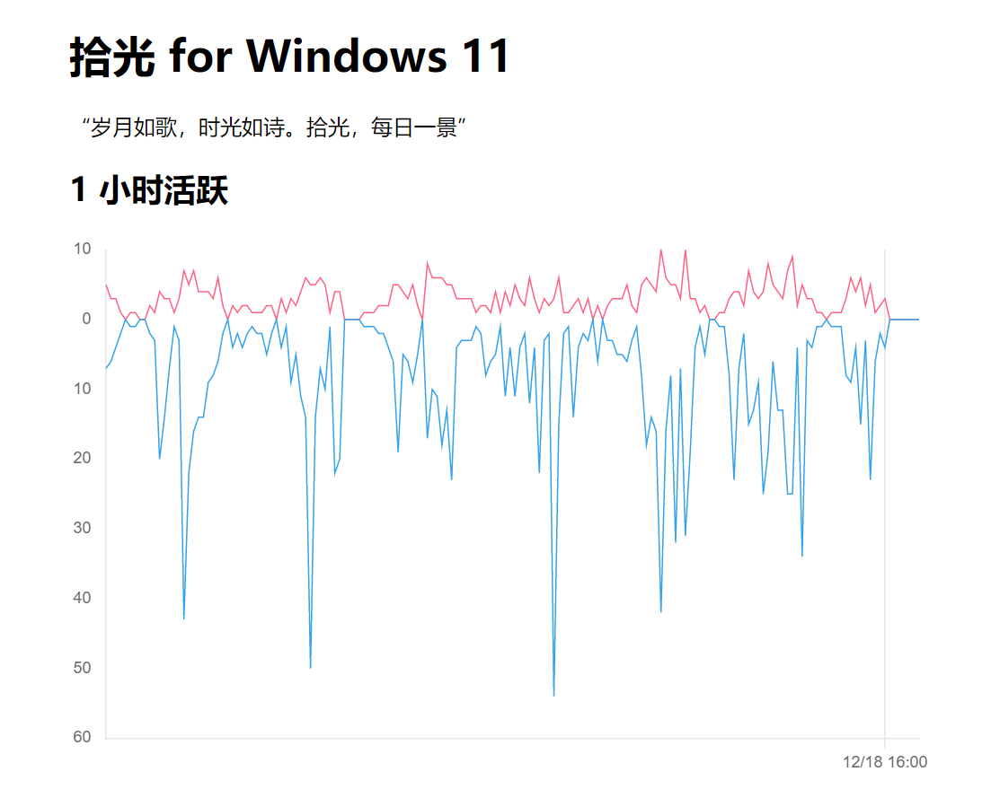
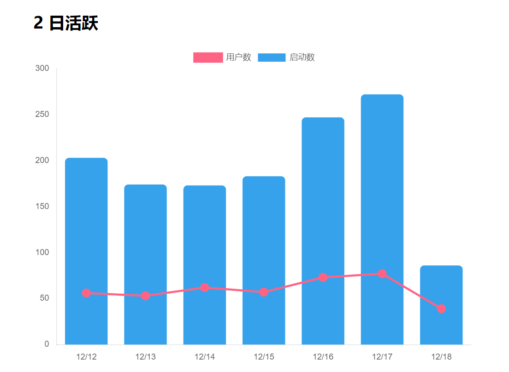
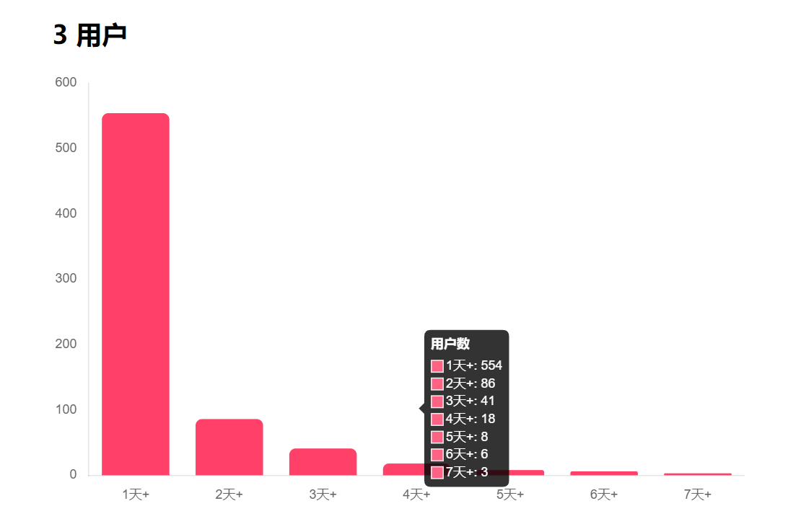
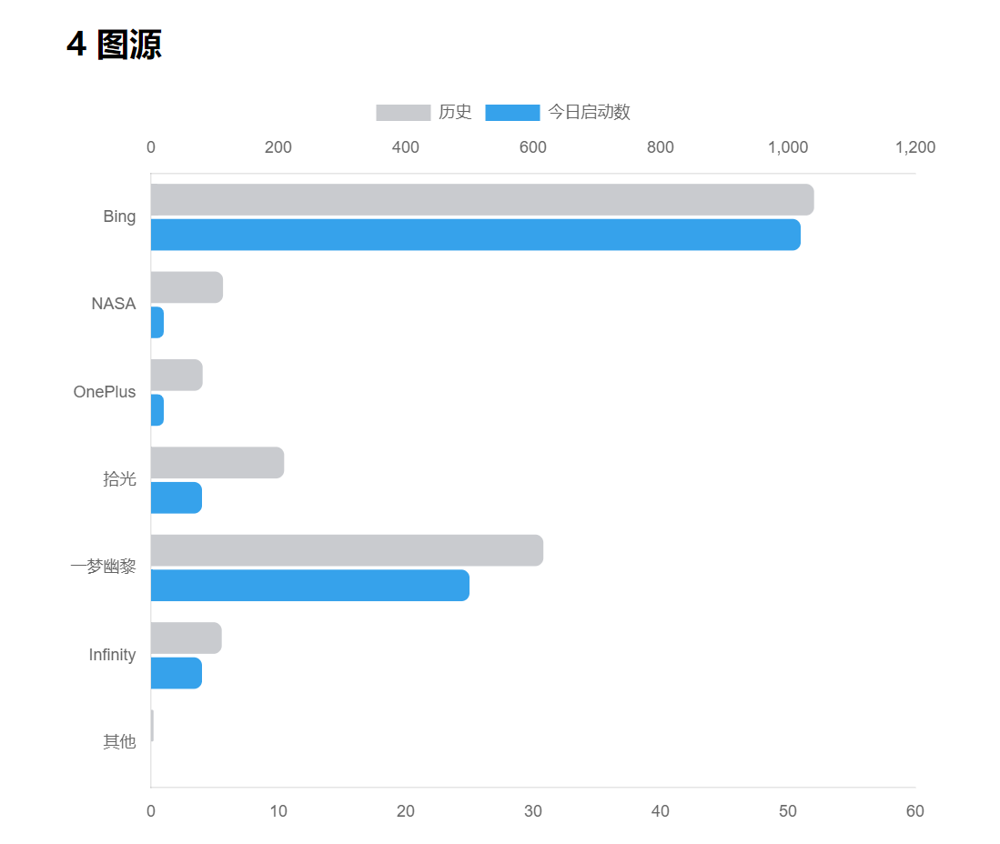
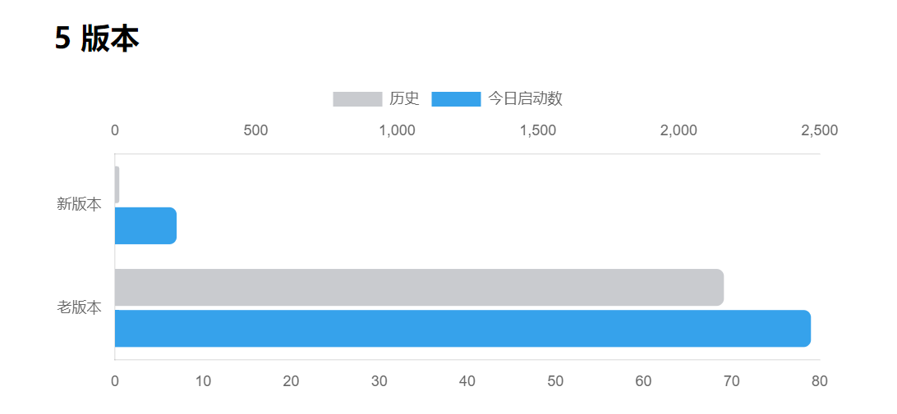
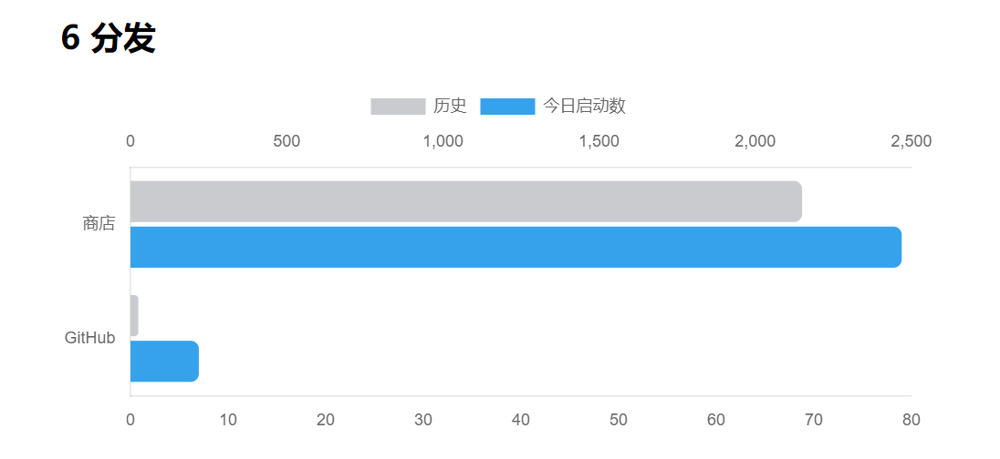
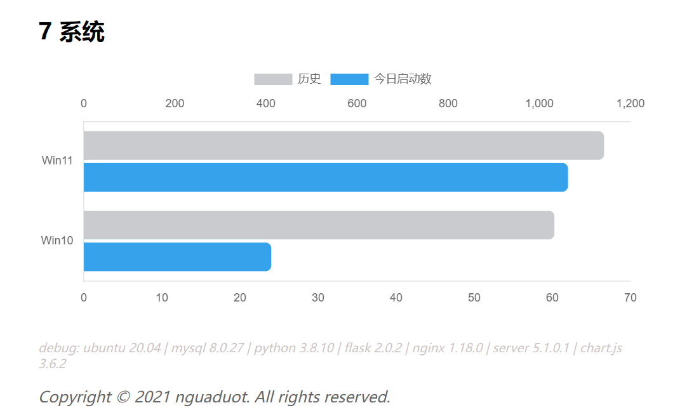

# APP 运营统计服务

随 Windows 应用 [拾光 for Windows 11](https://github.com/nguaduot/TimelineWallpaper) 发布而开发的一套简易可用的统计服务。不借助第三方统计 SDK，达到随时掌握 `拾光` 运营状况的目的。

后端数据存储选用 `MySQL`，服务器基于 `Python3` 搭建（使用 `Flask` Web 框架），借助 `Nginx` 做反向代理和负载均衡，前端通过 `Chart.js` 插件展示图表数据。

## 1 API

| API | 参数 | 说明 |
| --- | --- | --- |
| POST `/appstats` | 略 | APP 采集的数据通过该接口传输至服务器 |
| GET `/appstats/timeline` | 略 | 数据监控页面 |

## 2 数据监控

### 2.1 小时活跃



### 2.2 日活跃



### 2.3 用户



### 2.4 图源



### 2.5 版本



### 2.6 分发



### 2.7 系统



## 3 搭建

```
服务器：云服务器 CVM
系统：Ubuntu 20.04 LTS
数据库：MySQL 8.0.27
托管：Flask on Python3
代理：Nginx 1.18.0
```

### 3.1 数据库

```sql
CREATE DATABASE `appstats`;

USE `appstats`;

CREATE TABLE `call` (
  `id` bigint NOT NULL AUTO_INCREMENT,
  `app` varchar(64) CHARACTER SET utf8mb4 COLLATE utf8mb4_unicode_ci DEFAULT NULL,
  `pkg` varchar(64) CHARACTER SET utf8mb4 COLLATE utf8mb4_unicode_ci DEFAULT NULL,
  `ver` varchar(64) CHARACTER SET utf8mb4 COLLATE utf8mb4_unicode_ci DEFAULT NULL,
  `api` varchar(128) CHARACTER SET utf8mb4 COLLATE utf8mb4_unicode_ci DEFAULT NULL,
  `status` tinyint(1) DEFAULT NULL,
  `os` varchar(64) CHARACTER SET utf8mb4 COLLATE utf8mb4_unicode_ci DEFAULT NULL,
  `osver` varchar(64) CHARACTER SET utf8mb4 COLLATE utf8mb4_unicode_ci DEFAULT NULL,
  `device` varchar(64) CHARACTER SET utf8mb4 COLLATE utf8mb4_unicode_ci DEFAULT NULL,
  `deviceid` varchar(64) COLLATE utf8mb4_unicode_ci DEFAULT NULL,
  `ip` varchar(32) CHARACTER SET utf8mb4 COLLATE utf8mb4_unicode_ci DEFAULT NULL,
  `timestamp` datetime DEFAULT CURRENT_TIMESTAMP,
  PRIMARY KEY (`id`) USING BTREE
) ENGINE=InnoDB AUTO_INCREMENT=2956 DEFAULT CHARSET=utf8mb4 COLLATE=utf8mb4_unicode_ci;

CREATE VIEW `timeline` AS
SELECT
  *
FROM
  `call`
WHERE
  `call`.`app` = "拾光 for Windows 11"
  AND `call`.`os` = "Windows.Desktop"
  AND NOT `call`.`deviceid` IN ("");

CREATE VIEW `stats` AS
SELECT
  DATE(`timeline`.`timestamp`) AS `date`,
  COUNT(*) AS `total`,
  CAST(SUM(IF(INSTR(`timeline`.`pkg`, "fp51msqsmzpvr") > 0, 1, 0)) AS SIGNED) AS `store`,
  CAST(SUM(IF(CONCAT(LPAD(SUBSTRING_INDEX(SUBSTRING_INDEX(`timeline`.`osver`, ".", 1), ".", -1), 5, "0"), LPAD(SUBSTRING_INDEX(SUBSTRING_INDEX(`timeline`.`osver`, ".", 2), ".", -1), 5, "0"), LPAD(SUBSTRING_INDEX(SUBSTRING_INDEX(`timeline`.`osver`, ".", 3), ".", -1), 5, "0"), LPAD(SUBSTRING_INDEX(SUBSTRING_INDEX(`timeline`.`osver`, ".", 4), ".", -1), 5, "0")) >= "00010000002200000194", 1, 0)) AS SIGNED) AS `win11`,
  CAST(SUM(IF(CONCAT(LPAD(SUBSTRING_INDEX(SUBSTRING_INDEX(`timeline`.`ver`, ".", 1), ".", -1), 2, "0"), LPAD(SUBSTRING_INDEX(SUBSTRING_INDEX(`timeline`.`ver`, ".", 2), ".", -1), 2, "0")) >= "0203", 1, 0)) AS SIGNED) AS `newver`,
  COUNT(DISTINCT `timeline`.`deviceid`) AS `devices`,
  COUNT(DISTINCT `timeline`.`ip`) AS `ips`,
  CAST(SUM(IF(`timeline`.`status` = 1, 1, 0)) AS SIGNED) AS `success`,
  CAST(SUM(IF(INSTR(`timeline`.`api`, "/bing") > 0, 1, 0)) AS SIGNED) AS `/bing`,
  CAST(SUM(IF(INSTR(`timeline`.`api`, "/nasa") > 0, 1, 0)) AS SIGNED) AS `/nasa`,
  CAST(SUM(IF(INSTR(`timeline`.`api`, "/oneplus") > 0, 1, 0)) AS SIGNED) AS `/oneplus`,
  CAST(SUM(IF(INSTR(`timeline`.`api`, "/timeline") > 0, 1, 0)) AS SIGNED) AS `/timeline`,
  CAST(SUM(IF(INSTR(`timeline`.`api`, "/ymyouli") > 0, 1, 0)) AS SIGNED) AS `/ymyouli`,
  CAST(SUM(IF(INSTR(`timeline`.`api`, "/infinity") > 0, 1, 0)) AS SIGNED) AS `/infinity`
FROM
  `timeline`
GROUP BY
  DATE(`timeline`.`timestamp`)
WITH ROLLUP;

CREATE VIEW `fans` AS
SELECT
  COUNT(CASE WHEN `days` >= 1 THEN 1 END) AS `d1`,
  COUNT(CASE WHEN `days` >= 2 THEN 1 END) AS `d2`,
  COUNT(CASE WHEN `days` >= 3 THEN 1 END) AS `d3`,
  COUNT(CASE WHEN `days` >= 4 THEN 1 END) AS `d4`,
  COUNT(CASE WHEN `days` >= 5 THEN 1 END) AS `d5`,
  COUNT(CASE WHEN `days` >= 6 THEN 1 END) AS `d6`,
  COUNT(CASE WHEN `days` >= 7 THEN 1 END) AS `d7`
FROM (
SELECT
  `d1`.`deviceid`,
  COUNT(*) AS `days`
FROM (
SELECT DISTINCT
  DATE(`timeline`.`timestamp`) AS `date`,
  `timeline`.`deviceid`
FROM
  `timeline`
) AS `d1`
GROUP BY
  `d1`.`deviceid`
) AS `d2`;

CREATE VIEW `beat` AS
WITH RECURSIVE hours(n) AS (
SELECT
  1
UNION ALL
SELECT
  n + 1
FROM
  hours
WHERE
  n < 24 * 7
)
SELECT
  `d1`.`hour`,
  IFNULL(`d2`.`total`, 0) AS `total`,
  IFNULL(`d3`.`devices`, 0) AS `devices`
FROM (
SELECT
  DATE_FORMAT(DATE_ADD(DATE_ADD(CURRENT_DATE, INTERVAL -6 DAY), INTERVAL n-1 HOUR), "%m%d%H") AS `hour`
FROM
  `hours`
) AS `d1` LEFT JOIN (
SELECT
  DATE_FORMAT(`timestamp`, "%m%d%H") AS `hour`,
  COUNT(*) AS `total`
FROM
  `timeline`
WHERE
  `timestamp` > DATE_ADD(NOW(), INTERVAL -8 DAY)
GROUP BY
  `hour`
) AS `d2` ON `d1`.`hour` = `d2`.`hour` LEFT JOIN (
SELECT
  DATE_FORMAT(`timestamp`, "%m%d%H") AS `hour`,
  COUNT(DISTINCT `deviceid`) AS `devices`
FROM
  `timeline`
WHERE
  `timestamp` > DATE_ADD(NOW(), INTERVAL -8 DAY)
GROUP BY
  `hour`
) AS `d3` ON `d1`.`hour` = `d3`.`hour`;
```

### 3.2 Python 版服务器

#### 3.2.1 依赖

```
# apt install python3
apt install python3-pip
pip install pymysql
pip install flask
```

源码：[/python](./python)

#### 3.2.2 运行

```
# 启动
nohup python3 /home/appstats/python/appstats5100.py >> /home/appstats/python/flask.log 2>&1 &
nohup python3 /home/appstats/python/appstats5101.py >> /home/appstats/python/flask.log 2>&1 &

# 停止
ps -aux | grep timeline
kill -9 xxx
```

### 3.3 Nginx 反向代理

```
# 安装
apt install nginx

# 检查
nginx -t -c /etc/nginx/nginx.conf
# 重启
systemctl restart nginx
```

```
# /etc/nginx/nginx.conf

http {
  # include /etc/nginx/sites-enabled/*;
  upstream upappstats {
    server localhost:5100;
    server localhost:5101;
  }
  server {
    # listen 443 ssl;
    # ssl_certificate /home/timeline/cert/1_api.nguaduot.cn_bundle.crt;
    # ssl_certificate_key /home/timeline/cert/2_api.nguaduot.cn.key;
    # server_name api.nguaduot.cn;
    listen 80;
    server_name localhost;
    location /appstats {
      proxy_pass http://upappstats;
      proxy_set_header Host $host;
      proxy_set_header X-Real-IP $remote_addr;
      proxy_set_header X-Forwarded-For $proxy_add_x_forwarded_for;
    }
  }
}
```

*Copyright © 2021 nguaduot. All rights reserved.*